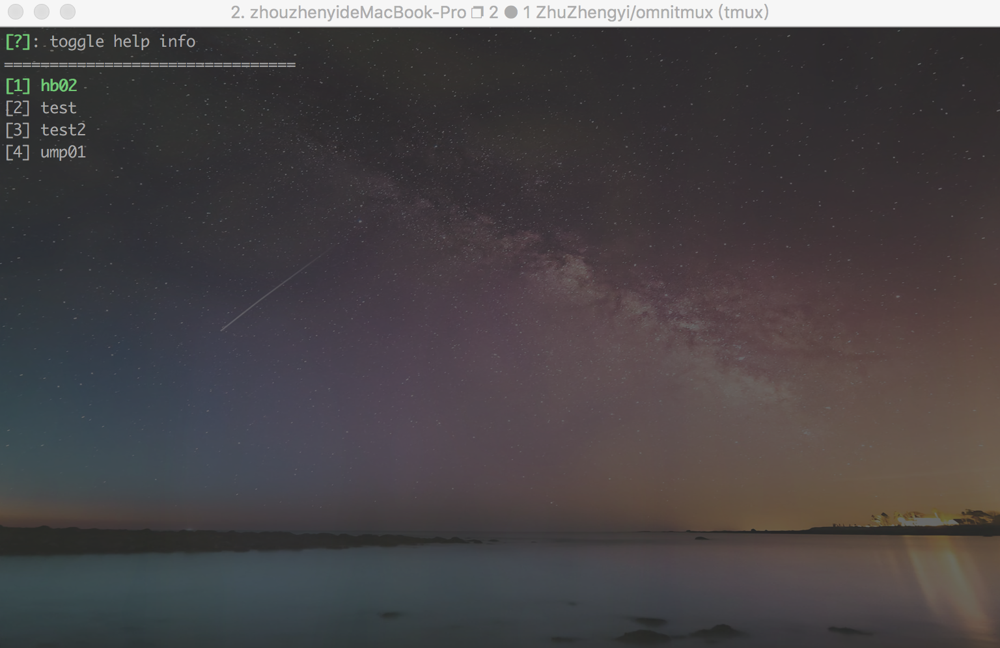
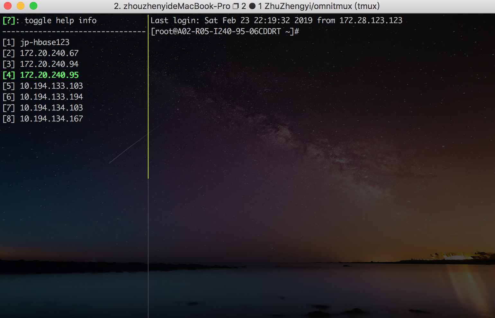

# OmniTmux

A cluster operate tool base tmux as omnitty, inspired by tmuxbro.

## Feature

* cluster list
* cluster/host stage
* multicast mode
* like vim key bind

## Demo






## KeyMap

### cluster stage

* j/J/UP: next cluster
* k/K/DOWN: prev cluster
* m: jump to middle cluster
* e: jump to end cluster
* `<ENTER>`: enter into stage host of current cluster
* x: exit

### host stage

* j/J/UP: next host
* k/K/DOWN: prev host
* t: tag current host
* T: tag all hosts
* c: enable multicast mode
* `<ESC>`: disable multicast mode
* `<ENTER>`: enter current host
* m: jump to middle host
* e: jump to end host
* r: reconnect current host
* R: reconnect all hosts
* a: add hosts
* d: delete current host
* q: quit to stage cluster
* ?: toggle help info
* x: exit

## Config path

clusters config path:`~/.config/omnitmux/cluster/`

## Run

must start tmux first:

```shell
$ tmux
```

then run with:

```shell
$ ./omnitmux.sh  ./nodes		# start by load file nodes which contain cluster hosts
$ ./omnitmux.sh  				# start with clusters under default config path 
```

cluster hosts file must likes:

```shell
$ cat ./nodes
user1@172.20.240.95
10.194.133.103
10.194.133.194
10.194.134.103
10.194.134.167
10.194.135.8
```

all hosts should ssh config to be login in

